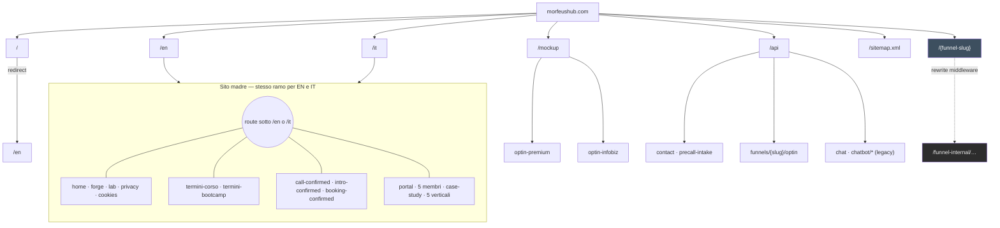
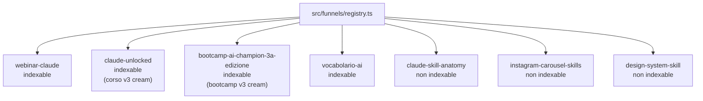
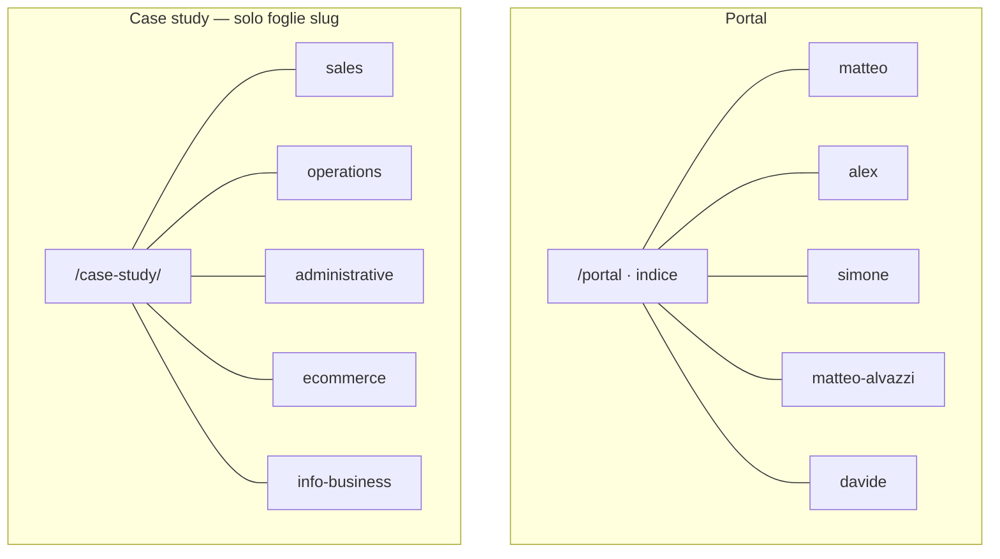

# Site tree — Morfeus (codice attuale)

**Base URL pubblica:** `https://morfeushub.com`
**Generato da:** struttura `src/app/`, `src/middleware.ts`, slug ammessi nel codice, `src/lib/reserved-slugs.ts`, `src/funnels/registry.ts`.
**Aggiorna questo file** quando aggiungi route, slug o funnel registrati.

**Anteprima grafico:** apri l'anteprima Markdown (es. in Cursor: anteprima del file) oppure carica il repo su GitHub: il blocco Mermaid sotto viene renderizzato automaticamente.

---

## Albero navigazione (link cliccabili)

Ogni cella è un link assoluto: **Ctrl+click** / **Cmd+click** per aprire in una nuova scheda dall'anteprima Markdown o dall'editor.

**Produzione:** host `https://morfeushub.com`. **Locale:** stessi path su `http://localhost:3000` (es. `http://localhost:3000/it/portal`).

Le **aree** qui sotto separano ingresso, marketing, legale, post-call, portal, proof, mockup, strumenti e funnel — non è una singola lista piatta.

---

### Area A — Ingresso e lingua

| Ruolo | EN | IT |
|--------|----|----|
| Root (redirect verso EN di default) | [→ /en](https://morfeushub.com/) | — |
| Homepage | [/en](https://morfeushub.com/en) | [/it](https://morfeushub.com/it) |

---

### Area B — Landing "Operating system" / Lab

| Pagina | EN | IT |
|----|----|----|
| Forge | [/forge](https://morfeushub.com/en/forge) | [/forge](https://morfeushub.com/it/forge) |
| Lab | [/lab](https://morfeushub.com/en/lab) | [/lab](https://morfeushub.com/it/lab) |

---

### Area C — Note legali

| Pagina | EN | IT |
|--------|----|----|
| Privacy | [/privacy](https://morfeushub.com/en/privacy) | [/privacy](https://morfeushub.com/it/privacy) |
| Cookie policy | [/cookies](https://morfeushub.com/en/cookies) | [/cookies](https://morfeushub.com/it/cookies) |
| Termini Corso (Claude Unlocked) | [/termini-corso](https://morfeushub.com/en/termini-corso) | [/termini-corso](https://morfeushub.com/it/termini-corso) |
| Termini Bootcamp (AI Champion) | [/termini-bootcamp](https://morfeushub.com/en/termini-bootcamp) | [/termini-bootcamp](https://morfeushub.com/it/termini-bootcamp) |

---

### Area D — Flusso post-chiamata

| Pagina | EN | IT |
|--------|----|----|
| Call confirmed | [/call-confirmed](https://morfeushub.com/en/call-confirmed) | [/call-confirmed](https://morfeushub.com/it/call-confirmed) |
| Intro confirmed | [/intro-confirmed](https://morfeushub.com/en/intro-confirmed) | [/intro-confirmed](https://morfeushub.com/it/intro-confirmed) |
| Booking confirmed | [/booking-confirmed](https://morfeushub.com/en/booking-confirmed) | [/booking-confirmed](https://morfeushub.com/it/booking-confirmed) |
| Thank you | [/call-confirmed/thank-you](https://morfeushub.com/en/call-confirmed/thank-you) | [/call-confirmed/thank-you](https://morfeushub.com/it/call-confirmed/thank-you) |

---

### Area E — Portal team (schede membri)

| Pagina | EN | IT |
|--------|----|----|
| Indice portal | [/portal](https://morfeushub.com/en/portal) | [/portal](https://morfeushub.com/it/portal) |
| Matteo Arnaboldi | [/portal/matteo](https://morfeushub.com/en/portal/matteo) | [/portal/matteo](https://morfeushub.com/it/portal/matteo) |
| Alex Carofiglio | [/portal/alex](https://morfeushub.com/en/portal/alex) | [/portal/alex](https://morfeushub.com/it/portal/alex) |
| Simone Zin | [/portal/simone](https://morfeushub.com/en/portal/simone) | [/portal/simone](https://morfeushub.com/it/portal/simone) |
| Matteo Alvazzi | [/portal/matteo-alvazzi](https://morfeushub.com/en/portal/matteo-alvazzi) | [/portal/matteo-alvazzi](https://morfeushub.com/it/portal/matteo-alvazzi) |
| Davide Bertolini | [/portal/davide](https://morfeushub.com/en/portal/davide) | [/portal/davide](https://morfeushub.com/it/portal/davide) |

---

### Area F — Case study (proof)

*Stesse URL con prefisso `/it` o `/en`.*

| Verticale | EN | IT |
|-----------|----|----|
| Sales | [/case-study/sales](https://morfeushub.com/en/case-study/sales) | [/case-study/sales](https://morfeushub.com/it/case-study/sales) |
| Operations | [/case-study/operations](https://morfeushub.com/en/case-study/operations) | [/case-study/operations](https://morfeushub.com/it/case-study/operations) |
| Administrative | [/case-study/administrative](https://morfeushub.com/en/case-study/administrative) | [/case-study/administrative](https://morfeushub.com/it/case-study/administrative) |
| E-commerce | [/case-study/ecommerce](https://morfeushub.com/en/case-study/ecommerce) | [/case-study/ecommerce](https://morfeushub.com/it/case-study/ecommerce) |
| Info-business | [/case-study/info-business](https://morfeushub.com/en/case-study/info-business) | [/case-study/info-business](https://morfeushub.com/it/case-study/info-business) |

---

### Area G — Mockup (niente prefisso lingua)

*Middleware tratta `/mockup` a parte dal sito madre.*

| Pagina | Link |
|--------|------|
| Opt-in premium | [/mockup/optin-premium](https://morfeushub.com/mockup/optin-premium) |
| Opt-in infobiz | [/mockup/optin-infobiz](https://morfeushub.com/mockup/optin-infobiz) |

---

### Area H — Strumenti e API (non pagine di contenuto)

| Risorsa | URL | Note |
|---------|-----|------|
| Sitemap XML | [/sitemap.xml](https://morfeushub.com/sitemap.xml) | Elenca pagine pubbliche core + case study EN/IT |
| Contact API | `/api/contact` | `POST` — vedi `src/app/api/contact/route.ts` |
| Precall intake API | `/api/precall-intake` | `POST` — vedi `src/app/api/precall-intake/route.ts` |
| Optin webinar Claude | `/api/funnels/webinar-claude/optin` | `POST` — Brevo subscription |
| Optin freebie Cowork Skill | `/api/funnels/freebie-cowork-setup-skill/optin` | `POST` — Brevo subscription |
| Optin freebie IG Carousel | `/api/funnels/freebie-instagram-carousel-skills/optin` | `POST` — Brevo subscription |
| Optin freebie Design System | `/api/funnels/freebie-design-system-blueprint/optin` | `POST` — Brevo subscription |
| Chat / Chatbot APIs | `/api/chat`, `/api/chatbot/*` | Legacy (chatbot custom dismesso, sostituito da piattaforma proprietaria esterna) |

---

### Area I — Funnel (root senza `/en` né `/it`)

Tutti i funnel sono registrati in `src/funnels/registry.ts` e riscritti dal middleware su `/funnel-internal/{slug}/...`.

| Funnel | URL pubbliche | Indexable | Stato |
|--------|---------------|-----------|-------|
| **Webinar Claude** | [/webinar-claude](https://morfeushub.com/webinar-claude) · [/webinar-claude/thank-you](https://morfeushub.com/webinar-claude/thank-you) | ✅ true | Lead-magnet webinar registrato (replay) |
| **Corso Claude Unlocked** | [/claude-unlocked](https://morfeushub.com/claude-unlocked) · [/claude-unlocked/access-9x4q2k7n](https://morfeushub.com/claude-unlocked/access-9x4q2k7n) | ✅ true | Sales page corso (palette arancione, sezioni alternate dark/cream). Versioni v1/v2 oscurate. |
| **Bootcamp AI Champion (3a Edizione)** | [/bootcamp-ai-champion-3a-edizione](https://morfeushub.com/bootcamp-ai-champion-3a-edizione) · [/bootcamp-ai-champion-3a-edizione/access-25-m3p8r7q4](https://morfeushub.com/bootcamp-ai-champion-3a-edizione/access-25-m3p8r7q4) | ✅ true | Sales page bootcamp (palette lime + dark olive, sezioni alternate dark/cream). URL precedenti `/bootcamp-ai-champion`, `/bootcamp-ai-champion-v2`, `/bootcamp-ai-champion-v3` oscurati. |
| **Vocabolario AI** | [/vocabolario-ai](https://morfeushub.com/vocabolario-ai) | ✅ true | Glossario AI/Claude pubblicamente indicizzabile (60+ termini) |
| **Freebie · Claude Skill Anatomy** | [/claude-skill-anatomy](https://morfeushub.com/claude-skill-anatomy) · [/claude-skill-anatomy/thank-you](https://morfeushub.com/claude-skill-anatomy/thank-you) | ❌ false | Lead-magnet skill cowork setup |
| **Freebie · Instagram Carousel Skills** | [/instagram-carousel-skills](https://morfeushub.com/instagram-carousel-skills) · [/instagram-carousel-skills/thank-you](https://morfeushub.com/instagram-carousel-skills/thank-you) | ❌ false | Lead-magnet skill IG carousel |
| **Freebie · AI Design System Blueprint** | [/design-system-skill](https://morfeushub.com/design-system-skill) | ❌ false | Lead-magnet skill design system |

**URL oscurati (404)**: `/bootcamp-ai-champion`, `/bootcamp-ai-champion-v2`, `/bootcamp-ai-champion-v3`, `/claude-unlocked-v1`, `/claude-unlocked-v2`, `/claude-unlocked-v3`. Componenti restano in codebase per rollback.

---

### Mappa rapida aree → scopo

| Area | Scopo navigazione |
|------|-------------------|
| **A** | Entrata sito e scelta lingua |
| **B** | Landing operating system + lab |
| **C** | Privacy, cookie, termini di servizio |
| **D** | Stato / ringraziamento dopo call |
| **E** | Mini-sito team / contatti |
| **F** | Case study proof (indexabili e visibili a crawler AI) |
| **G** | Mock interni / design |
| **H** | SEO sitemap, API contact + funnel optin |
| **I** | Campagne funnel a slug dedicato (sales, lead-magnet, glossari) |

---

## Grafico (Mermaid)

Panorama ad alto livello: root, due lingue con lo stesso albero, mockup, API, sitemap, funnel.



### Dettaglio funnel registrati



### Dettaglio portal e case study (slug noti nel codice)

Prefisso: `/{en|it}`.



---

## Albero logico (route Next.js)

```
/
├── page.tsx                    → redirect permanente a /en
│
├── en/                         ← locale (next-intl)
│   ├── (home)                  … page.tsx
│   ├── forge/
│   ├── lab/
│   ├── privacy/
│   ├── cookies/
│   ├── termini-corso/
│   ├── termini-bootcamp/
│   ├── call-confirmed/
│   │   └── thank-you/
│   ├── intro-confirmed/
│   ├── booking-confirmed/
│   ├── portal/
│   │   └── [slug]/             → matteo | alex | simone | matteo-alvazzi | davide
│   └── case-study/
│       └── [slug]/             → vedi elenco slug sotto
│
├── it/                         ← stesso albero di en/ (mirror)
│
├── mockup/                     ← senza prefisso locale (middleware)
│   ├── optin-premium/
│   └── optin-infobiz/
│
├── api/
│   ├── contact/                → route.ts
│   ├── precall-intake/         → route.ts
│   ├── chat/                   → route.ts (legacy)
│   ├── chatbot/                → analytics, conversations, retry-leads (legacy)
│   └── funnels/
│       ├── webinar-claude/optin/
│       ├── freebie-cowork-setup-skill/optin/
│       ├── freebie-instagram-carousel-skills/optin/
│       └── freebie-design-system-blueprint/optin/
│
├── sitemap.ts                  → /sitemap.xml
│
├── __funnels/                  ← rewrite alternativo (compat)
│   └── [slug]/[[...step]]/
│
└── funnel-internal/            ← target interno (rewrite middleware)
    └── [slug]/
        └── [[...step]]/        → pubblico come /{slug}/… quando il funnel è registrato
```

---

## URL completi — sito madre (`/{locale}/…`)

Locale ammessi: **`en`**, **`it`** (da `src/i18n/routing.ts`).

### Principali

- `/` → Redirect a `/en` (`src/app/page.tsx`)
- `/en` → Homepage EN
- `/it` → Homepage IT

### Landing

- `/en/forge` · `/it/forge` → Landing forge ("operating system")
- `/en/lab` · `/it/lab` → Landing lab

### Legali e Termini

- `/en/privacy` · `/it/privacy` → Privacy
- `/en/cookies` · `/it/cookies` → Cookie policy
- `/en/termini-corso` · `/it/termini-corso` → Termini e condizioni Corso (Claude Unlocked)
- `/en/termini-bootcamp` · `/it/termini-bootcamp` → Termini e condizioni Bootcamp (AI Champion)

### Flusso Post-Call

- `/en/call-confirmed` · `/it/call-confirmed` → Post-call conferma (outbound / lead freddi, form visibile)
- `/en/call-confirmed/thank-you` · `/it/call-confirmed/thank-you` → Thank you post-form
- `/en/intro-confirmed` · `/it/intro-confirmed` → Post-call warm (lead caldi, solo video)
- `/en/booking-confirmed` · `/it/booking-confirmed` → Post-call network (caffè/conoscenti, solo conferma)

### Portal Team

- `/en/portal` · `/it/portal` → Indice portal
- `/en/portal/matteo` · `/it/portal/matteo` → Scheda membro (`src/app/lib/team-data.ts`)
- `/en/portal/alex` · `/it/portal/alex`
- `/en/portal/simone` · `/it/portal/simone`
- `/en/portal/matteo-alvazzi` · `/it/portal/matteo-alvazzi`
- `/en/portal/davide` · `/it/portal/davide`

### Case study (`/case-study/[slug]`)

Slug ammessi in `src/app/[locale]/case-study/[slug]/page.tsx` (`ALLOWED_CASE_SLUGS`):

- `sales`
- `operations`
- `administrative`
- `ecommerce`
- `info-business`

Esempi:

- `https://morfeushub.com/en/case-study/sales`
- `https://morfeushub.com/it/case-study/ecommerce`
- … (tutte le combinazioni locale × slug)

**Robots:** per queste pagine il metadata nel route imposta `index: false, follow: false`.

---

## URL — mockup (design review)

Path che **non** passano dal prefisso locale; il middleware imposta solo `x-next-intl-locale` di default per `pathname.startsWith("/mockup")`.

| URL |
|-----|
| `https://morfeushub.com/mockup/optin-premium` |
| `https://morfeushub.com/mockup/optin-infobiz` |

---

## Funnel (root `/` senza locale)

- **Comportamento:** se il primo segmento del path è uno **slug funnel registrato**, `src/middleware.ts` riscrive verso `/funnel-internal/{slug}/...`.
- **Stato attuale (registry.ts):**
  - `webinar-claude` (indexable)
  - `claude-unlocked` (indexable) — corso v3 cream
  - `bootcamp-ai-champion-3a-edizione` (indexable) — bootcamp v3 cream
  - `vocabolario-ai` (indexable)
  - `claude-skill-anatomy` (non indexable)
  - `instagram-carousel-skills` (non indexable)
  - `design-system-skill` (non indexable)
- Path interno (non da linkare agli utenti): `/funnel-internal/{slug}` e sotto-path degli step definiti nel JSON config (`step.path`).

URL pubbliche attive:

- `https://morfeushub.com/webinar-claude`
- `https://morfeushub.com/webinar-claude/thank-you`
- `https://morfeushub.com/claude-unlocked`
- `https://morfeushub.com/claude-unlocked/access-9x4q2k7n` (TY post-acquisto)
- `https://morfeushub.com/bootcamp-ai-champion-3a-edizione`
- `https://morfeushub.com/bootcamp-ai-champion-3a-edizione/access-25-m3p8r7q4` (TY post-acquisto)
- `https://morfeushub.com/vocabolario-ai`
- `https://morfeushub.com/claude-skill-anatomy`
- `https://morfeushub.com/claude-skill-anatomy/thank-you`
- `https://morfeushub.com/instagram-carousel-skills`
- `https://morfeushub.com/instagram-carousel-skills/thank-you`
- `https://morfeushub.com/design-system-skill`

URL **oscurate** (404 dopo l'oscuramento dei v1/v2/v3):

- `https://morfeushub.com/claude-unlocked-v1`
- `https://morfeushub.com/claude-unlocked-v2`
- `https://morfeushub.com/claude-unlocked-v3`
- `https://morfeushub.com/bootcamp-ai-champion`
- `https://morfeushub.com/bootcamp-ai-champion-v2`
- `https://morfeushub.com/bootcamp-ai-champion-v3`

---

## API

| Metodo / path | File |
|---------------|------|
| `POST` `/api/contact` | `src/app/api/contact/route.ts` |
| `POST` `/api/precall-intake` | `src/app/api/precall-intake/route.ts` |
| `POST` `/api/funnels/webinar-claude/optin` | Brevo subscription |
| `POST` `/api/funnels/freebie-cowork-setup-skill/optin` | Brevo subscription |
| `POST` `/api/funnels/freebie-instagram-carousel-skills/optin` | Brevo subscription |
| `POST` `/api/funnels/freebie-design-system-blueprint/optin` | Brevo subscription |
| `/api/chat`, `/api/chatbot/*` | Legacy — chatbot custom dismesso, sostituito da piattaforma proprietaria esterna |

---

## Sitemap XML

- **Route:** `https://morfeushub.com/sitemap.xml` (da `src/app/sitemap.ts`).
- **Contenuto attuale:** solo `/en` e `/it` (homepage). Le altre pagine elencate qui **non** sono tutte nel `sitemap.ts` — se vuoi SEO allineata, va esteso il generatore (in particolare per i nuovi funnel indexable: `claude-unlocked`, `bootcamp-ai-champion-3a-edizione`, `vocabolario-ai`).

---

## Slug riservati (non usabili come funnel)

Da `src/lib/reserved-slugs.ts`:

`it`, `en`, `servizi`, `case-study`, `portal`, `privacy`, `cookies`, `termini-bootcamp`, `forge`, `lab`, `call-confirmed`, `aperitalk`, `aperitivo`, `api`, `_next`, `_vercel`, `__funnels`, `funnel-internal`, `mockup`

> Nota: `termini-corso` non è ancora nella reserved list ma è una pagina sito madre. Se mai si registrasse un funnel con questo slug ci sarebbe collisione.

---

## Cartelle documentate ma senza `page.tsx`

- `src/app/[locale]/servizi/` — presente solo `README.md` (**nessuna pagina servizi deployata** da questo segmento).
- La doc di prodotto può ancora menzionare `/servizi/[slug]`: non è nell'albero runtime finché non esiste la route.

---

## Riepilogo conteggi URL "foglia" pubblici (orientativo)

- Home: **2** (en, it)
- Sito madre per locale (forge, lab, privacy, cookies, termini-corso, termini-bootcamp, call-confirmed, thank-you, intro-confirmed, booking-confirmed, portal index): **11 × 2 = 22**
- Portal membro: **5 × 2 = 10**
- Case study: **5 × 2 = 10**
- Mockup: **2**
- Funnel registrati (sales + thank-you dove presente): **~13** (webinar 2, corso 2, bootcamp 2, vocabolario 1, claude-skill 2, instagram-carousel 2, design-system 1, +/- TY)

**Totale ~59 URL** (inclusi i funnel registrati, esclusa `/` che redireziona).

---

*Ultimo allineamento al codice: 2026-05-04 — dopo canonicalizzazione URL `claude-unlocked` + `bootcamp-ai-champion-3a-edizione` e oscuramento v1/v2/v3 (commit 1846e03).*
