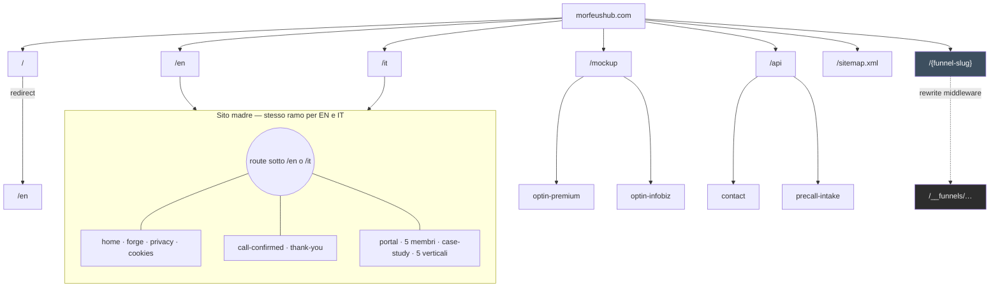
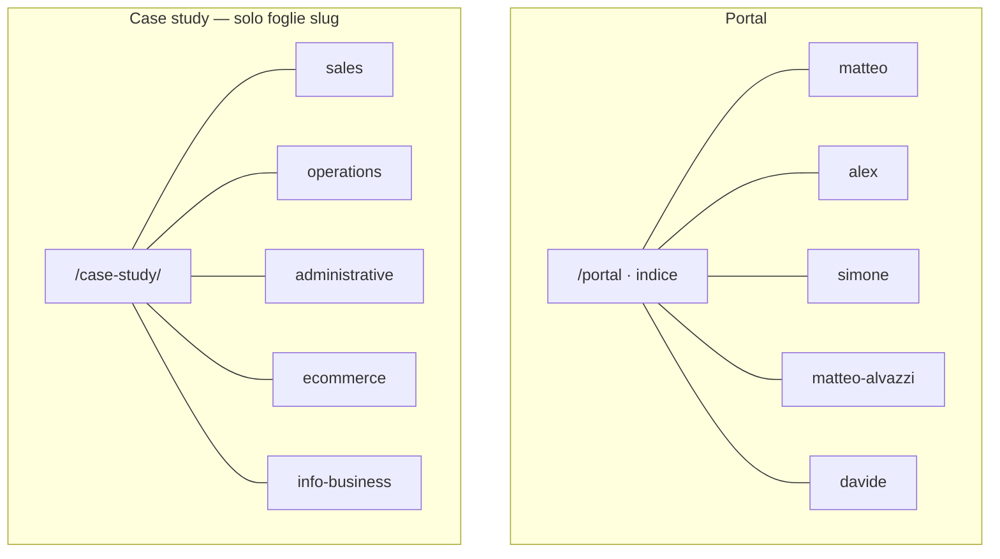

# Site tree — Morfeus (codice attuale)

**Base URL pubblica:** `https://morfeushub.com`  
**Generato da:** struttura `src/app/`, `src/middleware.ts`, slug ammessi nel codice, `src/lib/reserved-slugs.ts`.  
**Aggiorna questo file** quando aggiungi route, slug o funnel registrati.

**Anteprima grafico:** apri l’anteprima Markdown (es. in Cursor: anteprima del file) oppure carica il repo su GitHub: il blocco Mermaid sotto viene renderizzato automaticamente.

---

## Albero navigazione (link cliccabili)

Ogni cella è un link assoluto: **Ctrl+click** / **Cmd+click** per aprire in una nuova scheda dall’anteprima Markdown o dall’editor.

**Produzione:** host `https://morfeushub.com`. **Locale:** stessi path su `http://localhost:3000` (es. `http://localhost:3000/it/portal`).

Le **aree** qui sotto separano ingresso, marketing, legale, post-call, portal, proof, mockup, strumenti e funnel — non è una singola lista piatta.

---

### Area A — Ingresso e lingua

| Ruolo | EN | IT |
|--------|----|----|
| Root (redirect verso EN di default) | [→ /en](https://morfeushub.com/) | — |
| Homepage | [/en](https://morfeushub.com/en) | [/it](https://morfeushub.com/it) |

---

### Area B — Landing “Operating system”

| EN | IT |
|----|----|
| [/forge](https://morfeushub.com/en/forge) | [/forge](https://morfeushub.com/it/forge) |

---

### Area C — Note legali

| Pagina | EN | IT |
|--------|----|----|
| Privacy | [/privacy](https://morfeushub.com/en/privacy) | [/privacy](https://morfeushub.com/it/privacy) |
| Cookie policy | [/cookies](https://morfeushub.com/en/cookies) | [/cookies](https://morfeushub.com/it/cookies) |

---

### Area D — Flusso post-chiamata

| Pagina | EN | IT |
|--------|----|----|
| Call confirmed | [/call-confirmed](https://morfeushub.com/en/call-confirmed) | [/call-confirmed](https://morfeushub.com/it/call-confirmed) |
| Thank you | [/call-confirmed/thank-you](https://morfeushub.com/en/call-confirmed/thank-you) | [/call-confirmed/thank-you](https://morfeushub.com/it/call-confirmed/thank-you) |

---

### Area E — Portal team (schede membri)

| Pagina | EN | IT |
|--------|----|----|
| Indice portal | [/portal](https://morfeushub.com/en/portal) | [/portal](https://morfeushub.com/it/portal) |
| Matteo Arnaboldi | [/portal/matteo](https://morfeushub.com/en/portal/matteo) | [/portal/matteo](https://morfeushub.com/it/portal/matteo) |
| Alex Carofiglio | [/portal/alex](https://morfeushub.com/en/portal/alex) | [/portal/alex](https://morfeushub.com/it/portal/alex) |
| Simone Zin | [/portal/simone](https://morfeushub.com/en/portal/simone) | [/portal/simone](https://morfeushub.com/it/portal/simone) |
| Matteo Alvazzi | [/portal/matteo-alvazzi](https://morfeushub.com/en/portal/matteo-alvazzi) | [/portal/matteo-alvazzi](https://morfeushub.com/it/portal/matteo-alvazzi) |
| Davide Bertolini | [/portal/davide](https://morfeushub.com/en/portal/davide) | [/portal/davide](https://morfeushub.com/it/portal/davide) |

---

### Area F — Case study (proof)

*Stesse URL con prefisso `/it` o `/en`.*

| Verticale | EN | IT |
|-----------|----|----|
| Sales | [/case-study/sales](https://morfeushub.com/en/case-study/sales) | [/case-study/sales](https://morfeushub.com/it/case-study/sales) |
| Operations | [/case-study/operations](https://morfeushub.com/en/case-study/operations) | [/case-study/operations](https://morfeushub.com/it/case-study/operations) |
| Administrative | [/case-study/administrative](https://morfeushub.com/en/case-study/administrative) | [/case-study/administrative](https://morfeushub.com/it/case-study/administrative) |
| E-commerce | [/case-study/ecommerce](https://morfeushub.com/en/case-study/ecommerce) | [/case-study/ecommerce](https://morfeushub.com/it/case-study/ecommerce) |
| Info-business | [/case-study/info-business](https://morfeushub.com/en/case-study/info-business) | [/case-study/info-business](https://morfeushub.com/it/case-study/info-business) |

---

### Area G — Mockup (niente prefisso lingua)

*Middleware tratta `/mockup` a parte dal sito madre.*

| Pagina | Link |
|--------|------|
| Opt-in premium | [/mockup/optin-premium](https://morfeushub.com/mockup/optin-premium) |
| Opt-in infobiz | [/mockup/optin-infobiz](https://morfeushub.com/mockup/optin-infobiz) |

---

### Area H — Strumenti e API (non pagine di contenuto)

| Risorsa | URL | Note |
|---------|-----|------|
| Sitemap XML | [/sitemap.xml](https://morfeushub.com/sitemap.xml) | Elenca pagine pubbliche core + case study EN/IT |
| Contact API | `/api/contact` | `POST` — vedi `src/app/api/contact/route.ts` |
| Precall intake API | `/api/precall-intake` | `POST` — vedi `src/app/api/precall-intake/route.ts` |

---

### Area I — Funnel (root senza `/en` né `/it`)

| Stato | Note |
|--------|------|
| Nessun funnel registrato nel codice | Quando attivi un funnel, l’URL pubblico sarà `https://morfeushub.com/{slug}` (e sotto-path step); il middleware riscrive su `/__funnels/…` — **non** linkare `__funnels` direttamente. |

---

### Mappa rapida aree → scopo

| Area | Scopo navigazione |
|------|-------------------|
| **A** | Entrata sito e scelta lingua |
| **B** | Landing operating system |
| **C** | Privacy e cookie |
| **D** | Stato / ringraziamento dopo call |
| **E** | Mini-sito team / contatti |
| **F** | Case study proof (indexabili e visibili a crawler AI) |
| **G** | Mock interni / design |
| **H** | SEO sitemap e backend form |
| **I** | Campagne funnel a slug dedicato |

---

## Grafico (Mermaid)

Panorama ad alto livello: root, due lingue con lo stesso albero, mockup, API, sitemap, funnel.



### Dettaglio portal e case study (slug noti nel codice)

Prefisso: `/{en|it}`.



---

## Albero logico (route Next.js)

```
/
├── page.tsx                    → redirect permanente a /en
│
├── en/                         ← locale (next-intl)
│   ├── (home)                  … page.tsx
│   ├── forge/
│   ├── privacy/
│   ├── cookies/
│   ├── call-confirmed/
│   │   └── thank-you/
│   ├── portal/
│   │   └── [slug]/             → matteo | alex | simone | matteo-alvazzi | davide
│   └── case-study/
│       └── [slug]/             → vedi elenco slug sotto
│
├── it/                         ← stesso albero di en/ (mirror)
│
├── mockup/                     ← senza prefisso locale (middleware)
│   ├── optin-premium/
│   └── optin-infobiz/
│
├── api/
│   ├── contact/                → route.ts
│   └── precall-intake/         → route.ts
│
├── sitemap.ts                  → /sitemap.xml
│
└── __funnels/                  ← SOLO target interno (rewrite)
    └── [slug]/
        └── [[...step]]/        → pubblico come /{slug}/… quando il funnel è registrato
```

---

## URL completi — sito madre (`/{locale}/…`)

Locale ammessi: **`en`**, **`it`** (da `src/i18n/routing.ts`).

| Path | Note |
|------|------|
| `/` | Redirect → `/en` (`src/app/page.tsx`) |
| `/en` | Homepage EN |
| `/it` | Homepage IT |
| `/en/forge` | Landing forge |
| `/it/forge` | |
| `/en/privacy` | Privacy |
| `/it/privacy` | |
| `/en/cookies` | Cookie policy |
| `/it/cookies` | |
| `/en/call-confirmed` | Post-call / conferma |
| `/it/call-confirmed` | |
| `/en/call-confirmed/thank-you` | Thank you |
| `/it/call-confirmed/thank-you` | |
| `/en/portal` | Indice portal |
| `/it/portal` | |
| `/en/portal/matteo` | Scheda membro (`src/app/lib/team-data.ts`) |
| `/en/portal/alex` | |
| `/en/portal/simone` | |
| `/en/portal/matteo-alvazzi` | |
| `/en/portal/davide` | |
| `/it/portal/matteo` | (stessi slug, prefisso `/it`) |
| `/it/portal/alex` | |
| `/it/portal/simone` | |
| `/it/portal/matteo-alvazzi` | |
| `/it/portal/davide` | |

### Case study (`/case-study/[slug]`)

Slug ammessi in `src/app/[locale]/case-study/[slug]/page.tsx` (`ALLOWED_CASE_SLUGS`):

- `sales`
- `operations`
- `administrative`
- `ecommerce`
- `info-business`

Esempi:

- `https://morfeushub.com/en/case-study/sales`
- `https://morfeushub.com/it/case-study/ecommerce`
- … (tutte le combinazioni locale × slug)

** robots:** per queste pagine il metadata nel route imposta `index: false, follow: false`.

---

## URL — mockup (design review)

Path che **non** passano dal prefisso locale; il middleware imposta solo `x-next-intl-locale` di default per `pathname.startsWith("/mockup")`.

| URL |
|-----|
| `https://morfeushub.com/mockup/optin-premium` |
| `https://morfeushub.com/mockup/optin-infobiz` |

---

## Funnel (root `/` senza locale)

- **Comportamento:** se il primo segmento del path è uno **slug funnel registrato**, `src/middleware.ts` riscrive verso `/__funnels/{slug}/...`.
- **Stato attuale:** `src/funnels/registry.ts` espone `registerFunnel`, ma **nessun funnel è registrato** nel repo (nessuna chiamata a `registerFunnel` oltre la definizione). Quindi **nessun URL funnel pubblico** finché non aggiungi registrazione + config.
- Path interno (non da linkare agli utenti): `/__funnels/{slug}` e sotto-path degli step definiti nel JSON config (`step.path`).

---

## API

| Metodo / path | File |
|---------------|------|
| `POST` (e metodi definiti nel file) `/api/contact` | `src/app/api/contact/route.ts` |
| `POST` (e metodi definiti nel file) `/api/precall-intake` | `src/app/api/precall-intake/route.ts` |

---

## Sitemap XML

- **Route:** `https://morfeushub.com/sitemap.xml` (da `src/app/sitemap.ts`).
- **Contenuto attuale:** solo `/en` e `/it` (homepage). Le altre pagine elencate qui **non** sono tutte nel `sitemap.ts` — se vuoi SEO allineata, va esteso il generatore.

---

## Slug riservati (non usabili come funnel)

Da `src/lib/reserved-slugs.ts`:

`it`, `en`, `servizi`, `case-study`, `portal`, `privacy`, `cookies`, `forge`, `call-confirmed`, `api`, `_next`, `_vercel`, `__funnels`, `mockup`

---

## Cartelle documentate ma senza `page.tsx`

- `src/app/[locale]/servizi/` — presente solo `README.md` (**nessuna pagina servizi deployata** da questo segmento).
- La doc di prodotto può ancora menzionare `/servizi/[slug]`: non è nell’albero runtime finché non esiste la route.

---

## Riepilogo conteggi URL “foglia” pubblici (orientativo)

- Home: **2**
- Fisse per locale (forge, privacy, cookies, call-confirmed, thank-you, portal index): **6 × 2 = 12**
- Portal membro: **5 × 2 = 10**
- Case study: **5 × 2 = 10**
- Mockup: **2**

**Totale ~36 URL** (esclusi funnel futuri, esclusa `/` che redireziona).

---

*Ultimo allineamento al codice: generazione manuale da tree `src/app/`.*
